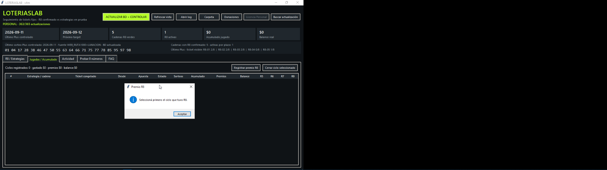
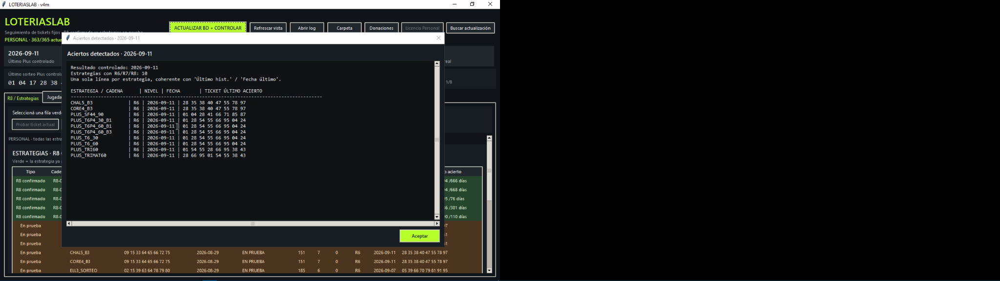

# LoteriasLab

**LoteriasLab** es una herramienta de análisis, simulación y seguimiento de estrategias para **Quiniela Plus Tradicional de Argentina**.

> Estado actual: **Windows · Argentina · Quiniela Plus Tradicional**

LoteriasLab trabaja con resultados históricos, permite probar combinaciones de 8 números, seguir estrategias a través del tiempo y registrar resultados R6, R7 y R8. El software no predice resultados ni garantiza premios.

## Disponible actualmente

- Quiniela Plus Tradicional.
- Histórico y control de resultados.
- Estrategias con seguimiento temporal.
- Simulación libre de 8 números.
- Seguimiento de R6, R7 y R8.
- Edición Free y edición Personal.
- Actualización automática de base de datos.
- Actualizaciones del programa preparadas para GitHub Releases.

## En desarrollo

- **Super Plus**
- **Chance Plus**

## Roadmap futuro

- **Quini 6**
- Nuevas estrategias y modelos de análisis.
- Mejoras de visualización, estadísticas y seguimiento.

## LoteriasLab Free

- 1 estrategia con R8 histórico visible.
- 2 estrategias en prueba visibles.
- 20 actualizaciones efectivas.
- Histórico.
- Probar 8 números.
- FAQ.
- Avisos R6/R7/R8.
- Donaciones opcionales.

## LoteriasLab Personal

- Todas las estrategias.
- Seguimiento completo.
- Jugadas y acumulado.
- 365 actualizaciones efectivas por licencia.
- Licencia vinculada a una PC.

## Descargar

La descarga oficial estará disponible desde **GitHub Releases**.

**Windows:** `LoteriasLab_Setup.exe`

Cuando exista un release publicado:

`https://github.com/LoteriasLab/LoteriasLab/releases/latest`

> No descargues LoteriasLab desde sitios de terceros que no estén enlazados desde este repositorio.

## Capturas

### Pantalla principal

### Aviso de aciertos

## Alcance

Actualmente LoteriasLab está diseñado **exclusivamente para Argentina** y para **Quiniela Plus Tradicional**.

No debe asumirse compatibilidad con loterías de otros países ni con otros juegos.

## Importante

LoteriasLab es una herramienta estadística y de seguimiento.

- No garantiza premios.
- No asegura ganancias.
- Los resultados históricos no garantizan resultados futuros.
- Los juegos de azar implican riesgo de pérdida.

LoteriasLab no representa ni está afiliado oficialmente a organismos de lotería.

## Plataforma

- ✅ Windows
- ⏳ macOS: futuro
- ⏳ Linux: futuro

## Soporte

Para errores o sugerencias podés utilizar **Issues** en este repositorio.

Las solicitudes de licencia Personal o renovación se realizan desde el propio programa.

## Licencia

LoteriasLab es software propietario. Este repositorio público se utiliza para documentación, seguimiento y distribución de versiones compiladas.

El código fuente del producto no forma parte de la distribución pública.
